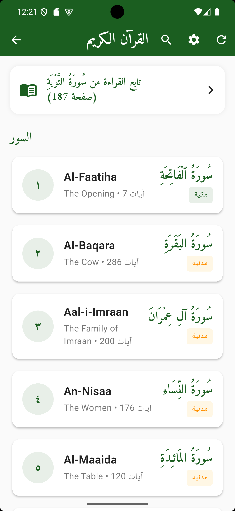

# Quran App (Flutter)

A modern, calm, and accessible Qur'an application built with Flutter. It focuses on a delightful reading experience, powerful diacritic‑insensitive search, and a cohesive theme for both light and dark modes.

<div align="center">
  
</div>

## ✨ Highlights

- Accessible, calm theming (light and dark) with high contrast and reduced glare
- Unified AppBar design across screens with rounded shape and Amiri typography
- Diacritic‑insensitive Arabic search (FTS‑accelerated) with visible match highlighting
- Search history: recent queries, clear all, and swipe‑to‑delete
- Surah reader with clean typography and modern cards
- Bookmarks: save and revisit ayahs quickly
- Prayer times: modern cards and horizontal overview
- Offline‑first local storage using sqflite and shared_preferences

## 📱 Features (Overview)

- Full Qur'an (Surahs and Ayahs)
- Surah Reader with continue reading
- Powerful Search
  - Normalizes Arabic text (removes tashkeel/diacritics, normalizes letters)
  - FTS (Full‑Text Search) table for fast queries + LIKE/legacy fallback
  - Highlighted matches in results
  - Search history with clear‑all and swipe‑to‑delete
- Bookmarks management
- Prayer times screens and widgets
- Settings (theme, options)

## 🧭 App Structure

- `lib/core` — DI, theming, routing, helpers (DB, Arabic utils, shared prefs)
- `lib/features/*` — Feature‑scoped data/logic/ui directories
  - `quran` — Qur'an data, surah list, models
  - `surah_reader` — Reading experience
  - `search` — Search repo/cubit/UI and result widgets
  - `bookmarks`, `prayer_times`, `settings`, `home` — Other modules

## 🚀 Getting Started

### Prerequisites
- Flutter SDK (3.x+ recommended): https://flutter.dev/docs/get-started/install
- Dart (bundled with Flutter)

### Installation
```bash
# Clone
git clone https://github.com/ahmedramadan-20/ZEKR.git
cd ZEKR

# Install dependencies
flutter pub get

# (Optional) Generate code if needed
flutter pub run build_runner build --delete-conflicting-outputs

# Run
flutter run
```

### First‑Run Notes
- Open the Qur'an screen once to download/load base data. This will populate the local database and power the search feature.
- Then open Search and try queries with or without diacritics. Results will be highlighted.

## 🎨 Theming & Accessibility
- Light mode: off‑white background (#FAFAFA), deep blue text (#1B365D), soft green primary (#4CAF50), gold secondary (#FFC845)
- Dark mode: deep gray background (#121212), dark surfaces (#1A1A1A / #1F1F1F), off‑white text (#E0E0E0)
- Gradients are subtle and charcoal‑based in dark mode to reduce glare
- Targets WCAG 2.1 contrast ratios (≥ 4.5:1 for normal text) where applicable

## 🔎 Search Details
- Normalization includes:
  - Remove diacritics and tatweel
  - Normalize forms: آ/أ/إ/ٱ→ا, ى/ي→ي, ؤ→و, ئ→ي, ة→ه
  - Strip Arabic punctuation
- FTS (fts4) with tokenized prefix matching and fallback to LIKE
- Legacy JSON scan fallback in rare cases

## 🧩 Key Packages
- flutter_bloc — state management
- dio, retrofit — networking
- freezed, json_serializable — models/codegen
- get_it — DI container
- sqflite, shared_preferences — local storage
- flutter_screenutil — responsive UI
- share_plus — sharing

See `pubspec.yaml` for the full list.

## 🧪 Running Tests
```bash
flutter test
```

## 🤝 Contributing
1. Fork the repo
2. Create a feature branch: `git checkout -b feature/your-feature`
3. Commit your changes: `git commit -m "feat: add your feature"`
4. Push the branch: `git push origin feature/your-feature`
5. Open a Pull Request

## 📜 License
No license currently. Consider adding MIT or Apache‑2.0.

## 🗒️ Notes
- CI workflow was temporarily removed in this branch to allow pushing without workflow scope; re‑add in a follow‑up PR with proper token permissions.
- Screenshots live under `assets/images/`.
